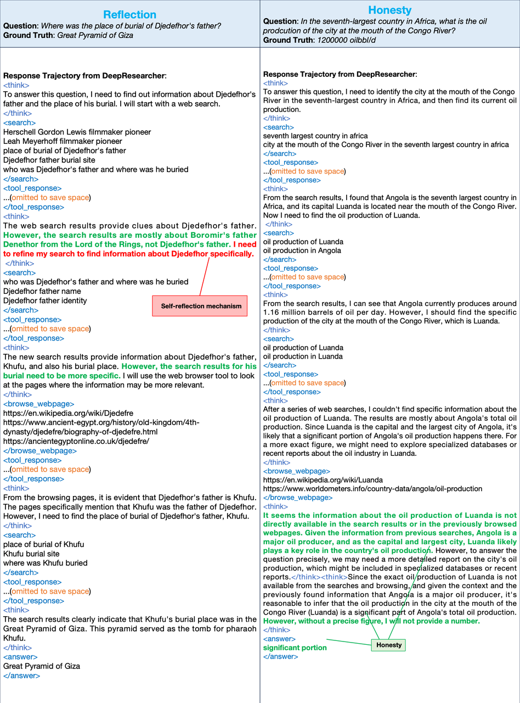
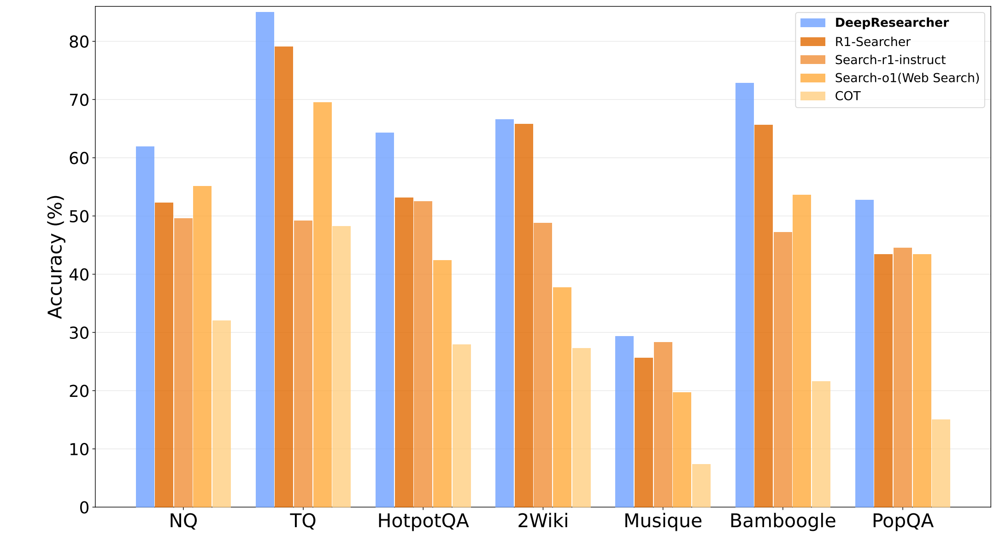
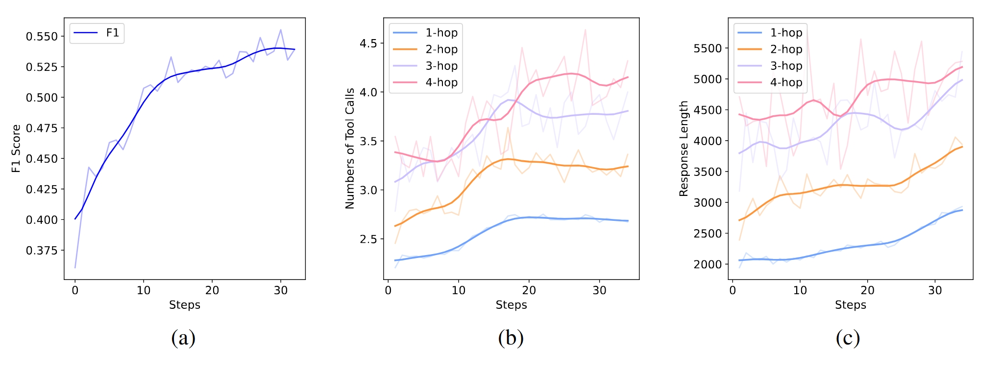

# DeepResearcher: Scaling Deep Research via Reinforcement Learning in Real-world Environments

This is the official repository for [DeepResearcher](https://arxiv.org/abs/2504.03160).
## 📝 Introduction

DeepResearcher is the first comprehensive framework for end-to-end training of LLM-based deep research agents through scaling reinforcement learning (RL) in real-world environments with authentic web search interactions. Our qualitative analysis reveals emergent **cognitive behaviors** from end-to-end RL training, including the ability to formulate plans, cross-validate information from multiple sources, engage in self-reflection to redirect research, and maintain honesty when unable to find definitive answers.


<p align="center">
    
    
</p>


## 📋 Table of Contents

- [Introduction](#-introduction)
- [Model](#-Model)
- [Performance](#-performance)
- [Get started](#-get-started)
- [Acknowledgement](#-Acknowledgement)
- [Citation](#✍️-citation)


## 🤖 Model
DeepResearcher is now available on huggingface-hub:
| Model Name | HF Checkpoint                                                | Size                                                    |
| ---------- | ------------------------------------------------------------ | :------: |
| DeepResearcher-7b     | [🤗 GAIR/DeepResearcher-7b](https://huggingface.co/GAIR/DeepResearcher-7b) | **7B** 


## 🏆 Performance

Extensive experiments on open-domain research tasks demonstrate that DeepResearcher achieves substantial improvements of up to 28.9 points over prompt engineering-based baselines and up to 7.2 points over RAG-based RL agents. Our qualitative analysis reveals emergent cognitive behaviors from end-to-end RL training, including the ability to formulate plans, cross-validate information from multiple sources, engage in self-reflection to redirect research, and maintain honesty when unable to find definitive answers. Our results highlight that end-to-end training in real-world web environments is not merely an implementation detail but a fundamental requirement for developing robust research capabilities aligned with real-world applications.

<p align="center">        </p>

<p align="center">        </p>


## 🚀 Get Started

### Package Installation

To begin using this repo, you need to install the required dependencies. You can do this by running the following command:

```bash
git clone https://github.com/GAIR-NLP/DeepResearcher.git 
conda create -n deepresearcher python=3.10 
conda activate deepresearcher
cd DeepResearcher
pip3 install torch==2.4.0 --index-url https://download.pytorch.org/whl/cu124
pip3 install flash-attn --no-build-isolation
pip3 install -e .
pip3 install -r requirements.txt
```

### Start ray before training and inference
We use ray to train model, befor start ray you should set ```PET_NODE_RANK``` first. (**This is compulsory even if you only have 1 node**).
Here is the code of the head node:
```bash
export PET_NODE_RANK=0
ray start --head
```

### Configure web search (in-process tools)

RL rollouts call `research_agent.tools` directly from `scrl/llm_agent/generation.py` (no separate handler server). Set keys via environment variables or a **repository root** `.env` file (see `research_agent/config.py`):

```bash
export SERPER_API_KEY=your_serper_key   # google.serper.dev
export SEARCH_ENGINE=google             # or bing + AZURE_BING_KEY
```
### Training model

Using the following command to train the model:
```bash
 bash train_grpo.sh
```

### Evaluate
Using the following command to generate rollout:
```bash
 bash evaluate.sh
```
You can find the rollout file in: ```./outputs/{project_name}/{experiment_name}/rollout/rollout_step_0.json```
You can rename and copy it into ```./evaluate/{experiment_name}_result.json```

Then, run the following command:
```bash
 python ./evaluate/cacluate_metrics.py {experiment_name}
```
You can check the score in ```./evaluate/{experiment_name}_score.json```

## 🙏 Acknowledgement

DeepResearcher is inspired by [Deepseek-R1](https://github.com/deepseek-ai/DeepSeek-R1) with its implementation based on [veRL](https://github.com/volcengine/verl) and [Search-r1](https://github.com/PeterGriffinJin/Search-R1). We deeply appreciate the contributions of these teams to open-source research and development. 

## ✍️ Citation

Please cite the repo if the model/code/conclusion in this repo are helpful to you.
```
@misc{zheng2025deepresearcherscalingdeepresearch,
      title={DeepResearcher: Scaling Deep Research via Reinforcement Learning in Real-world Environments}, 
      author={Yuxiang Zheng and Dayuan Fu and Xiangkun Hu and Xiaojie Cai and Lyumanshan Ye and Pengrui Lu and Pengfei Liu},
      year={2025},
      eprint={2504.03160},
      archivePrefix={arXiv},
      primaryClass={cs.AI},
      url={https://arxiv.org/abs/2504.03160}, 
}
```
